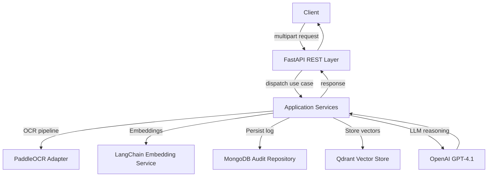

# Architecture Overview

## Layered Structure
- **Domain**: Entities (`Resume`, `ResumeChunk`, `QueryContext`, `AuditLog`), value objects, and policies remain pure and framework-agnostic.
- **Application**: Use cases orchestrate workflows (ingest, summarize, answer queries) through dependency-injected ports.
- **Infrastructure**: Adapters implementing OCR, vector storage, LLM, persistence, configuration, background processing, and logging.
- **Interfaces**: FastAPI routers/controllers and optional CLI for batch operations or admin utilities.

## Domain Model Highlights
- `Resume` aggregates metadata, OCR results, chunk IDs, and derived insights.
- `ResumeCollection` value object handles batch operations and ensures consistent pre-processing.
- `AuditLog` captures traceability without storing raw résumé content.
- Policies enforce supported MIME types, file size limits, rate limits, and redaction rules.

## Data Flow (Happy Path)
1. Client uploads documents with optional query.
2. API validates payload and emits job to application use case.
3. OCR adapter converts PDFs to images (PyMuPDF) and runs PaddleOCR to extract text, tables, and layout hints.
4. Text is chunked and embedded via OpenAI `text-embedding-3-large`; vectors stored in Qdrant with metadata.
5. If no query is supplied, summaries are generated via structured prompt.
6. For queries, LangChain RetrievalQA pulls relevant chunks, composes context, and queries GPT-4.1 with JSON output formatting.
7. Response and metadata returned; audit log stored in MongoDB (with TTL option for retention).

## Non-Functional Considerations
- **Scalability**: Adapters abstract future move to AWS S3, DynamoDB, SQS. Async tasks ready for celery/SQS workers.
- **Reliability**: Tenacity-based retries for transient OCR/vector/LLM failures, structured logging with correlation IDs.
- **Observability**: JSON logs, OpenTelemetry hooks (optional), health endpoints.
- **Security**: Configurable CORS, API key/auth placeholder, secrets managed via environment variables.

## Implementation Roadmap
1. Scaffold repository, configuration, and Dockerized infrastructure (**in progress**).
2. Implement domain models, DTOs, and validation logic.
3. Build OCR + embedding + LLM adapters with LangChain orchestration and integration tests.
4. Develop FastAPI endpoints with request/response schemas and swagger examples.
5. Add audit logging persistence, seeds, and fixtures using MongoDB test container.
6. Implement background processing hooks and CLI utilities.
7. Write unit, integration, and e2e tests; ensure >85% coverage.
8. Finalize documentation (README, ADRs, diagrams), provide CI pipeline template.

